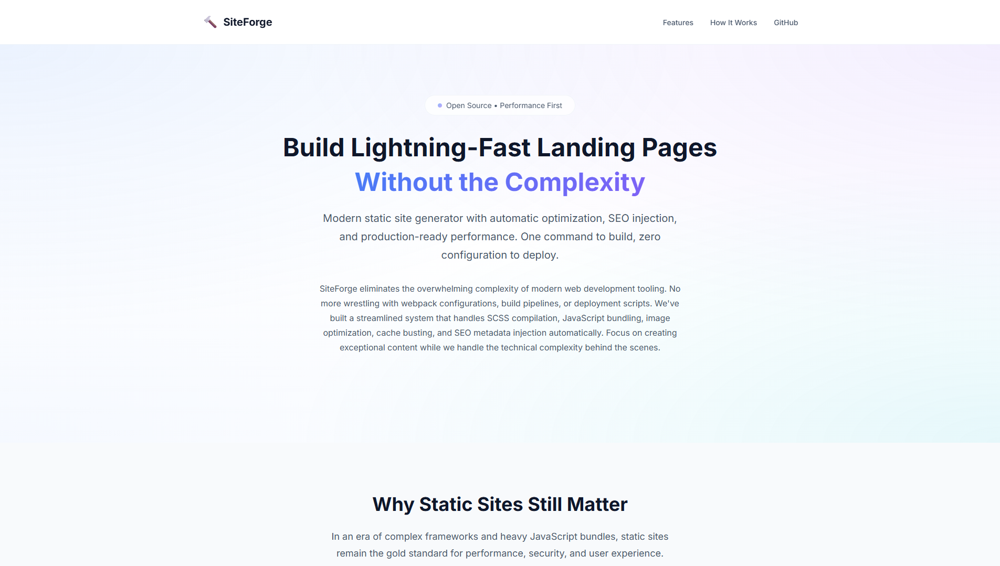
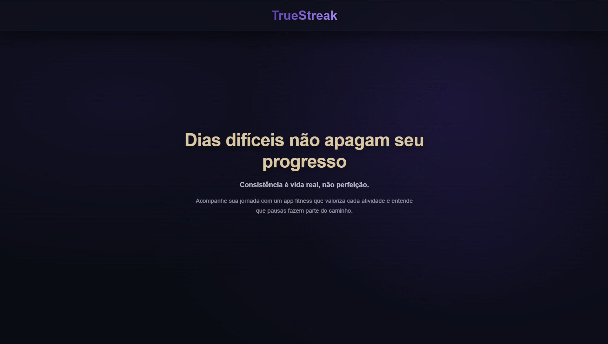
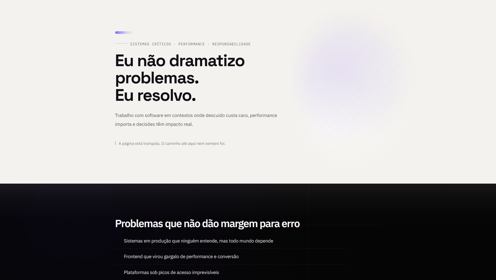

<div align="center">

# 👨‍💻 Samuel Caetité
### Full-Stack Developer | Building Systems That Work Under Pressure

[](mailto:srcaetite@gmail.com)
[](https://linkedin.com/in/samuelcaetite)
[](https://samuelcaetite.dev/)
[](https://wa.me/5511999510580)

</div>

---

## 🎯 Sobre Mim

Desenvolvedor de software formado em contextos onde **desatenção não é aceitável** e **improviso custa caro**.

Não escrevo código para parecer inteligente.  
Escrevo para **resolver problemas reais**, em **sistemas reais**, usados por **pessoas reais**, sob pressão de negócio, prazo e impacto.

### 💼 Experiência Real

- ✅ Black Fridays sem downtime
- ✅ Sistemas críticos de alta disponibilidade
- ✅ Produtos que não podem "cair para aprender"
- ✅ Ambientes caóticos transformados em previsíveis

**Meu trabalho:** Reduzir incerteza, trazer previsibilidade e deixar o sistema mais legível do que encontrei.

---

## 🧠 Filosofia de Desenvolvimento

```typescript
const principles = {
  code: "É lido muito mais vezes do que é escrito",
  legibility: "Também é otimização",
  abstraction: "Só vale o custo se reduzir sofrimento cognitivo",
  hype: "Passa. Responsabilidade fica.",
  frameworks: "São ferramentas, não religião",
  stack: "Serve ao problema, não ao ego"
};
```

> 🤖 Uso IA no dia a dia, reviso código gerado por IA e desconfio tanto de código "mágico" quanto de soluções excessivamente elegantes que só funcionam no dia em que foram escritas.

---
<div align="center">

## 🚀 Projetos em Destaque

### 🏗️ SiteForge
**Sistema modular para landing pages otimizadas**

[](https://samuelcaetite.dev/site-forge)

Build system zero-config com otimização automática: WebP, minificação, cache busting e SEO completo.

[](https://github.com/osamucadev/site-forge)
[](https://samuelcaetite.dev/site-forge)

---

### 💪 TrueStreak
**App de fitness focado em consistência sem culpa**

[](https://truestreak.life)

Aplicação moderna para acompanhamento de treinos com filosofia de progresso sustentável.

[](https://github.com/osamucadev/truestreak)
[](https://truestreak.life)

---

### 🌐 Portfolio
**Site pessoal com build system customizado**

[](https://samuelcaetite.dev)

Otimizado com SCSS, minificação, cache busting e analytics privacy-friendly.

[](https://github.com/osamucadev/frontsamuelcaetite)
[](https://samuelcaetite.dev)

</div>

---

## 🛠️ Stack Tecnológico

### 🎨 Frontend


### ⚙️ Backend & Infrastructure


### 📊 Foco em Qualidade


---

## 💡 Princípios Técnicos

| 🎯 Área | ✅ Abordagem |
|---------|--------------|
| **Frontend** | Não é estética, é responsabilidade técnica |
| **Backend** | Estabilidade, clareza e previsibilidade vêm antes de complexidade |
| **Mobile** | Extensão da experiência, não um produto isolado |
| **Performance** | Decisão arquitetural, não afterthought |
| **Código** | Precisa funcionar hoje e fazer sentido amanhã de manhã |
| **Stakeholder** | O "eu do futuro" também conta |
| **Ferramentas** | Por adequação, não por moda |

---

## 🤝 Vamos Conversar?

<div align="center">

**Aberto a oportunidades de trabalho remoto ou híbrido** 🌎

Se você chegou até aqui e algo fez sentido, **provavelmente falamos a mesma língua**.

[](mailto:srcaetite@gmail.com)
[](https://linkedin.com/in/samuelcaetite)
[](https://samuelcaetite.dev/)
[](https://wa.me/5511999510580)

</div>

---

<div align="center">
  
### 💭 "Se algo aqui parece simples, provavelmente foi pensado com cuidado."


</div>