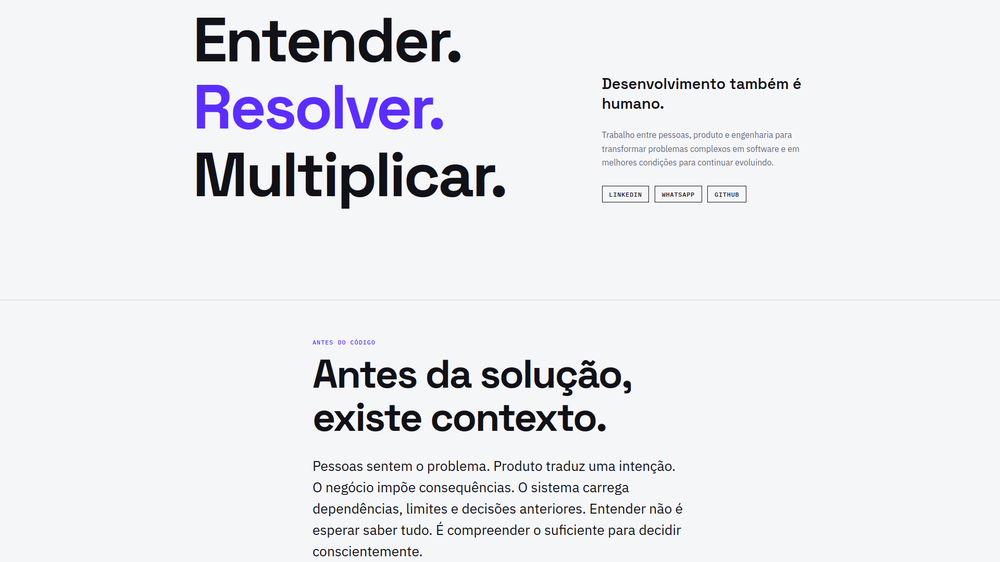
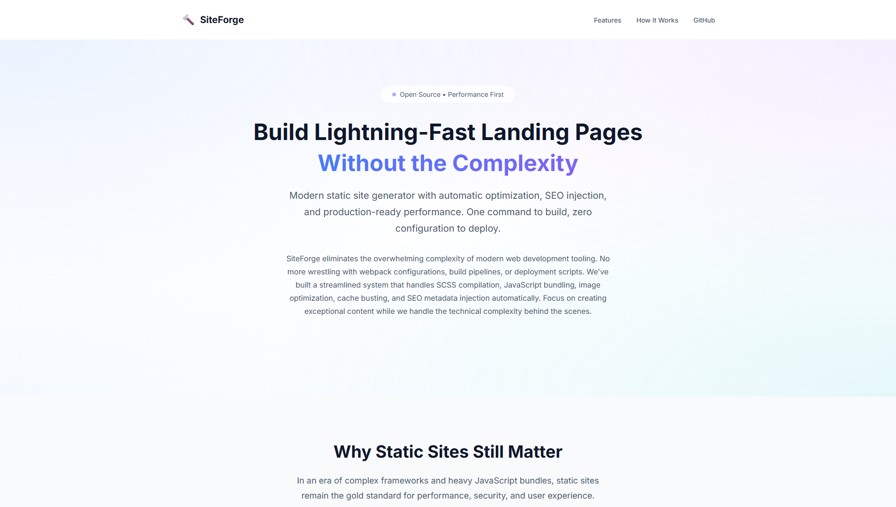
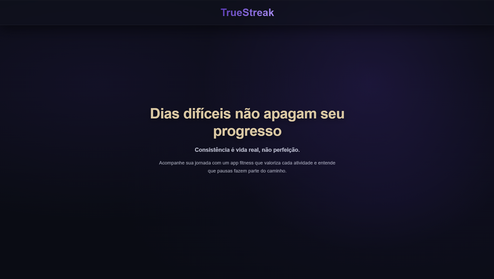

<div align="center">

# Samuel Caetité

### Desenvolvedor Full Stack Sênior

**Entender. Resolver. Multiplicar.**

Trabalho entre pessoas, produto e engenharia para transformar problemas complexos em software e criar melhores condições para continuar evoluindo.

<sub>Senior Full Stack Developer working across people, product, and engineering to turn complex problems into sustainable software.</sub>

[](https://samuelcaetite.dev)
[](https://linkedin.com/in/samuelcaetite)
[](https://github.com/osamucadev)
[](https://wa.me/5511999510580)

</div>

## Sobre mim

Desenvolvimento também é humano.

Antes do código, procuro compreender as pessoas que sentem o problema, a intenção do produto, as consequências para o negócio, o estado do sistema e suas restrições. Esse contexto orienta decisões técnicas responsáveis e evita que tecnologia vire um fim em si mesma.

Atualmente sou **Desenvolvedor Full Stack Sênior na VCASOFT**, trabalhando em iniciativas para **Vivo / Telefónica, Tecidos Kite e Feeagro**. Minha trajetória também inclui projetos para **Americanas, CNN Brasil e Universidade de São Paulo**, além de experiências na **DRIVEN.CX, Vorttex, Saveadd, React Legends e Habits**.

Meu trabalho costuma envolver:

- evolução progressiva de sistemas existentes;
- desenvolvimento full stack e integrações;
- e-commerce, performance e arquitetura web;
- descoberta técnica e decisões sob restrições reais;
- documentação, revisão, pareamento e liderança técnica;
- criação de ferramentas e condições para ampliar a autonomia do time.

## Como trabalho

```typescript
const principles = {
  context: "Entender o suficiente para decidir conscientemente",
  delivery: "Resolver o problema sem comprometer a próxima evolução",
  clarity: "Código, decisões e documentação precisam ser legíveis",
  modernization: "Transformar progressivamente sem ignorar o que já funciona",
  leadership: "Multiplicar conhecimento, ferramentas e autonomia",
  technology: "A stack serve ao problema, não ao ego"
};
```

Uso agentes de IA em investigação, implementação, revisão e testes. Eles ampliam minha capacidade de execução, mas contexto, julgamento, segurança e decisão técnica continuam sendo responsabilidades humanas.

## Projetos em destaque

### Portfólio profissional

[](https://samuelcaetite.dev)

Site estático multilíngue em português, inglês e espanhol, gerado a partir de uma única fonte e publicado em três sites do Firebase Hosting. O projeto inclui CSS versionado por conteúdo, metadados sociais, JSON-LD, sitemap, `llms.txt` e conteúdo específico para descoberta por mecanismos de busca e agentes.

[Código público](https://github.com/osamucadev/samuelcaetitedev-public) · [Site](https://samuelcaetite.dev) · [English](https://en.samuelcaetite.dev) · [Español](https://es.samuelcaetite.dev)

### SiteForge

[](https://github.com/osamucadev/site-forge)

Sistema modular para criação e publicação de landing pages estáticas. Automatiza otimização de imagens, minificação, versionamento de assets e fundamentos de SEO, mantendo cada página isolada e reproduzível.

[Código e documentação](https://github.com/osamucadev/site-forge)

### TrueStreak

[](https://truestreak.life)

Aplicação de acompanhamento de treinos com uma proposta de consistência sem culpa. O produto valoriza progresso sustentável e transforma esforço real em continuidade, sem tratar um dia difícil como perda de toda a evolução.

[Código](https://github.com/osamucadev/truestreak) · [Site](https://truestreak.life)

## Tecnologias e práticas

| Área | Experiência principal |
| --- | --- |
| Frontend | JavaScript, TypeScript, React, Next.js, Vue, HTML e CSS |
| Backend | Node.js, NestJS, APIs e integrações |
| Dados e infraestrutura | PostgreSQL, Firebase, AWS e Azure |
| Produto web | E-commerce, acessibilidade, SEO técnico e Web Performance |
| Engenharia | Arquitetura, modernização progressiva, testes, documentação e code review |
| Colaboração | Descoberta técnica, comunicação com stakeholders, pareamento e ensino |

Ferramentas mudam. Critério fica.

## Contato

Gosto de problemas interessantes e de gente boa para resolvê-los junto.

- [Portfólio](https://samuelcaetite.dev)
- [LinkedIn](https://linkedin.com/in/samuelcaetite)
- [E-mail](mailto:srcaetite@gmail.com)
- [WhatsApp](https://wa.me/5511999510580)

<div align="center">

**No fim, ainda é sobre pessoas.**

</div>
