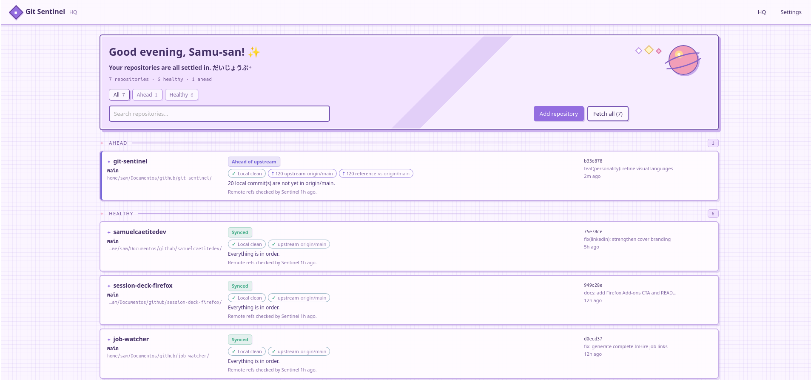

<div align="center">

# Samuel Caetité

### Senior Software Engineer

I build and evolve software across the full stack, from frontend and backend to mobile, with a focus on architecture, maintainability and progressive modernization.

[](https://samuelcaetite.dev)
[](https://linkedin.com/in/samuelcaetite)
[](https://github.com/osamucadev)
[](mailto:srcaetite@gmail.com)

</div>

## About

Over the years, my work has contributed to projects and products across organizations and industries including **BMW, iFood, University of São Paulo, Americanas, Pandora Jewelry, Vivo, Telefónica, Brazilian agribusiness, Bradesco, Tramontina, Riachuelo, Farmácia Indiana and UOL**.

Before writing code, I try to understand the people affected by a problem, the product intent, the business context and the constraints of the existing system. That context is what makes technical decisions responsible rather than just possible.

## How I work

```typescript
const engineeringApproach = {
  context: "Understand enough to decide deliberately",
  tradeoffs: "Weigh product, architecture and delivery constraints together",
  quality: "Test and document as part of building, not after",
  modernization: "Transform systems progressively, keep what already works",
  collaboration: "AI agents extend execution; judgment stays human",
};
```

## Professional Portfolio

[](https://samuelcaetite.dev)

My personal website holds the deeper version of my story: engineering approach, experience and selected work.

[Visit portfolio](https://samuelcaetite.dev)

## Selected Projects

<table>
<tr>
<td width="50%" valign="top">

**SiteForge**

[](https://github.com/osamucadev/site-forge)

A modular build system for static landing pages. Automates image optimization, minification and asset versioning, and adds SEO fundamentals, while keeping each page isolated and reproducible.

[Code and docs](https://github.com/osamucadev/site-forge)

</td>
<td width="50%" valign="top">

**TrueStreak**

[](https://truestreak.life)

A workout-tracking app built around guilt-free consistency. Values sustainable progress and turns real effort into continuity, instead of treating one hard day as lost progress.

[Code](https://github.com/osamucadev/truestreak) · [Site](https://truestreak.life)

</td>
</tr>
<tr>
<td width="50%" valign="top">

**Job Watcher**

[](https://github.com/osamucadev/job-watcher)

A self-hosted dashboard that monitors company career pages, surfaces new openings and keeps a history of past listings, so you don't have to check each site manually. The first version tracks InHire on a schedule, with keyword highlighting and non-destructive archiving.

[Code](https://github.com/osamucadev/job-watcher)

</td>
<td width="50%" valign="top">

**Git Sentinel**

[](https://github.com/osamucadev/git-sentinel)

A local-first desktop app that gives a single, scannable view of every Git repository on your machine: current branch, local changes, upstream status and project reference, without taking any automatic action on your behalf.

[Code](https://github.com/osamucadev/git-sentinel) · [Site](https://en.samuelcaetite.dev/git-sentinel)

</td>
</tr>
</table>

## Technologies

Strongest in JavaScript and TypeScript, with hands-on experience across these ecosystems:

**Languages**
JavaScript · TypeScript · Python · C# · PHP · Dart · C · C++ · Java

**Web & Backend**
React · Next.js · Vue · Node.js · Fastify · Express · FastAPI · .NET · Laravel · Symfony · WordPress

**Mobile & UI**
React Native · Flutter · Storybook · Tailwind CSS · Bootstrap

**Data & Engineering**
PostgreSQL · MySQL · Firebase · Docker · automated testing · CI/CD · AI-assisted development

