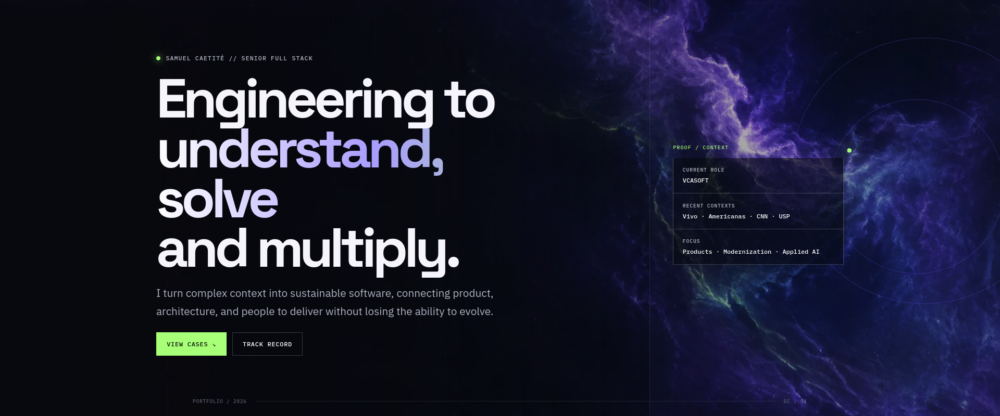
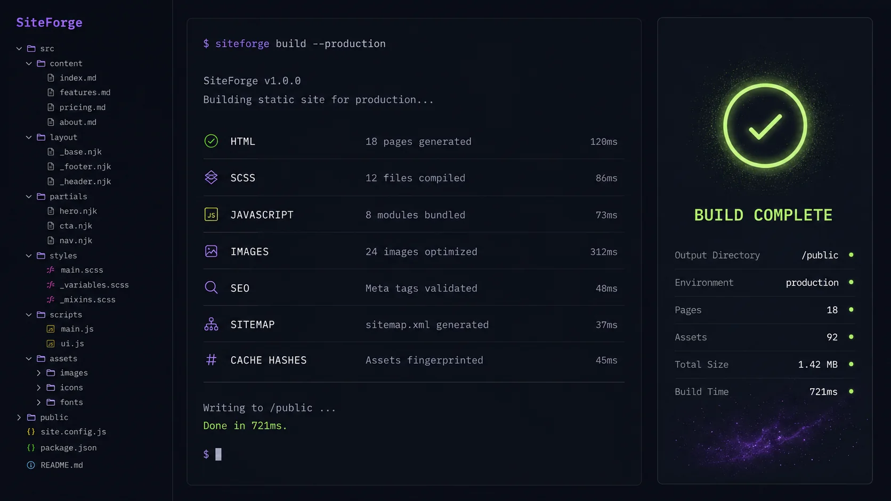
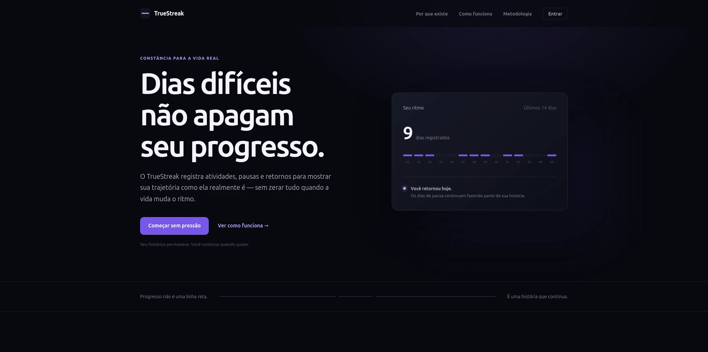
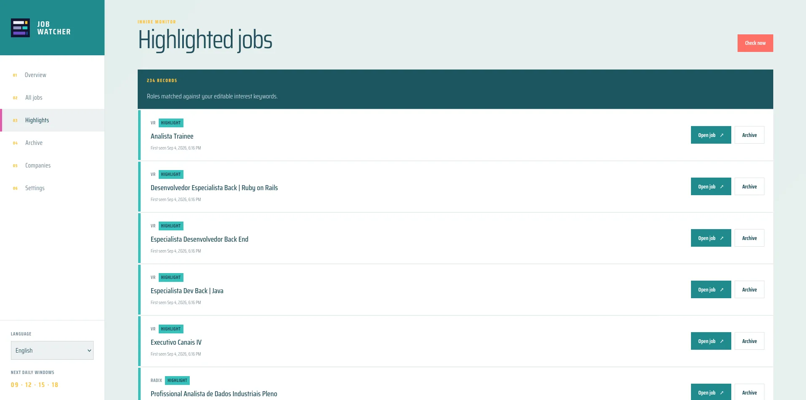

<div align="center">

# Samuel Caetité

### Senior Software Engineer

I build and evolve software across the full stack, from frontend and backend to mobile, with a focus on architecture, maintainability and progressive modernization.

[](https://samuelcaetite.dev)
[](https://linkedin.com/in/samuelcaetite)
[](https://github.com/osamucadev)
[](mailto:srcaetite@gmail.com)

</div>

## About

I work as a Senior Software Engineer, building and evolving software across web, backend and mobile, with a strong focus on maintainability, product context and pragmatic engineering.

Over the years, my work has contributed to projects and products connected to brands such as **BMW, iFood, University of São Paulo, Americanas, Pandora Jewelry, Vivo, Telefónica, Brazilian agribusiness, Bradesco, Tramontina, Riachuelo, Farmácia Indiana and UOL**.

Before writing code, I try to understand the people affected by a problem, the product intent, the business context and the constraints of the existing system. That context is what makes technical decisions responsible rather than just possible.

JavaScript and TypeScript are central to how I work, but I move across layers of a product as needed, from UI to APIs to infrastructure, rather than staying confined to one stack.

## How I work

```typescript
const principles = {
  context: "Understand enough to decide deliberately",
  delivery: "Solve the problem without blocking the next evolution",
  clarity: "Code, decisions and docs need to be readable",
  modernization: "Transform systems progressively, without ignoring what already works",
  leadership: "Multiply knowledge, tooling and autonomy",
  technology: "The stack serves the problem, not the other way around",
};
```

I use AI agents for investigation, implementation, review and testing. They extend how much I can execute, but context, judgment and technical decisions stay a human responsibility.

## Professional Portfolio

[](https://samuelcaetite.dev)

My personal website holds the deeper version of my story: engineering approach, experience and selected work.

[Visit portfolio](https://samuelcaetite.dev)

## Selected Projects

### SiteForge

[](https://github.com/osamucadev/site-forge)

A modular build system for static landing pages. It automates image optimization, minification and asset versioning, and adds SEO fundamentals, while keeping each page isolated and reproducible.

[Code and docs](https://github.com/osamucadev/site-forge)

### TrueStreak

[](https://truestreak.life)

A workout-tracking app built around guilt-free consistency. It values sustainable progress and turns real effort into continuity, instead of treating one hard day as lost progress.

[Code](https://github.com/osamucadev/truestreak) · [Site](https://truestreak.life)

### Job Watcher

[](https://github.com/osamucadev/job-watcher)

A self-hosted dashboard that monitors company career pages, surfaces new openings and keeps a history of past listings, so you don't have to check each site manually. The first version tracks InHire on a schedule, with keyword highlighting and non-destructive archiving.

[Code](https://github.com/osamucadev/job-watcher)

## Technologies

**Languages & Web:** JavaScript, TypeScript, React, Next.js, Vue, HTML, CSS
**Backend & Data:** Node.js, NestJS, PostgreSQL, Firebase
**Infrastructure:** AWS, Azure
**Practices:** Architecture, progressive modernization, testing, code review, technical documentation

